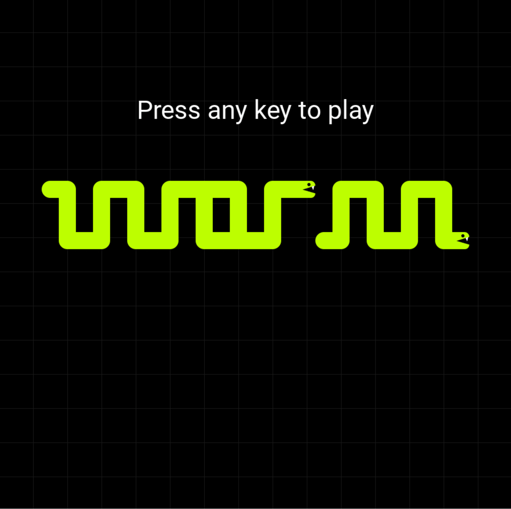

# Worm

A simple snake game in plain C + SDL2.
The graphics were made in Figma. The audio was made by recording an analog synth into Ableton.
This was made as a warmup project for the NYC Handmade Meetup. 
Finishing is its own skill, so I wanted to finish a small project before moving onto something more ambitious.

# Dependencies
- SDL2
- SDL_mixer
- SDL_image
- SDL_ttf

# Build
Clone the repo and build with Visual Studio 2022 or later.
